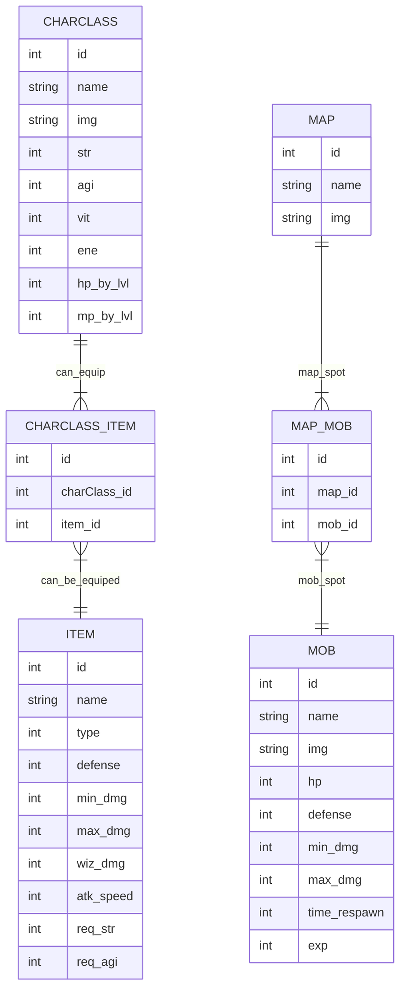
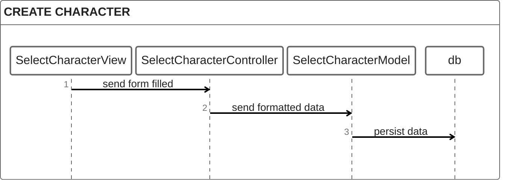

# lost-mu-game

Following the website lostmu.wiki to create a game.

## Diagrams

### Entity Relationship Diagrams



### Sequence Diagrams



## Database

### Create tables

```sql
CREATE TABLE CharClass (
  id INT GENERATED ALWAYS AS IDENTITY,
  name VARCHAR(255) NOT NULL,
  img VARCHAR(255),
  str INT NOT NULL DEFAULT 0,
  agi INT NOT NULL DEFAULT 0,
  vit INT NOT NULL DEFAULT 0,
  ene INT NOT NULL DEFAULT 0,
  hp_by_lvl INT NOT NULL DEFAULT 0,
  mp_by_lvl INT NOT NULL DEFAULT 0,
  PRIMARY KEY(id)
);

CREATE TABLE ItemType (
  id INT GENERATED ALWAYS AS IDENTITY,
  name VARCHAR(255) NOT NULL,
  PRIMARY KEY(id)
);

CREATE TABLE Item (
  id INT GENERATED ALWAYS AS IDENTITY,
  name VARCHAR(255) NOT NULL,
  img VARCHAR(255),
  def INT NOT NULL DEFAULT 0,
  min_dmg INT NOT NULL DEFAULT 0,
  max_dmg INT NOT NULL DEFAULT 0,
  wiz_dmg INT NOT NULL DEFAULT 0,
  atk_speed INT NOT NULL DEFAULT 0,
  req_str INT NOT NULL DEFAULT 0,
  req_agi INT NOT NULL DEFAULT 0,
  type_id INT NOT NULL,
  PRIMARY KEY(id),
  CONSTRAINT fk_type FOREIGN KEY (type_id) REFERENCES ItemType(id)
);

CREATE TABLE CharClass_Item (
  id INT GENERATED ALWAYS AS IDENTITY,
  charClass_id INT NOT NULL,
  item_id INT NOT NULL,
  PRIMARY KEY(id),
  CONSTRAINT fk_charClass FOREIGN KEY (charClass_id) REFERENCES CharClass(id),
  CONSTRAINT fk_item FOREIGN KEY (item_id) REFERENCES Item(id)
);

CREATE TABLE Map (
  id INT GENERATED ALWAYS AS IDENTITY,
  name VARCHAR(255) NOT NULL,
  img VARCHAR(255),
  PRIMARY KEY(id)
);

CREATE TABLE Mob (
  id INT GENERATED ALWAYS AS IDENTITY,
  name VARCHAR(255) NOT NULL,
  img VARCHAR(255),
  hp INT NOT NULL DEFAULT 1,
  def INT NOT NULL DEFAULT 0,
  min_dmg INT NOT NULL DEFAULT 0,
  max_dmg INT NOT NULL DEFAULT 0,
  time_respawn INT NOT NULL DEFAULT 0,
  PRIMARY KEY(id)
);

CREATE TABLE Spot (
  id INT GENERATED ALWAYS AS IDENTITY,
  x INT NOT NULL DEFAULT 0,
  y INT NOT NULL DEFAULT 0,
  map_id INT NOT NULL,
  PRIMARY KEY(id),
  CONSTRAINT fk_map FOREIGN KEY (map_id) REFERENCES Map(id)
);

CREATE TABLE Spot_Mob (
  id INT GENERATED ALWAYS AS IDENTITY,
  spot_id INT NOT NULL,
  mob_id INT NOT NULL,
  quantity INT NOT NULL DEFAULT 1,
  PRIMARY KEY(id),
  CONSTRAINT fk_spot FOREIGN KEY (spot_id) REFERENCES Spot(id),
  CONSTRAINT fk_mob FOREIGN KEY (mob_id) REFERENCES Mob(id)
);

CREATE TABLE Char (
  id INT GENERATED ALWAYS AS IDENTITY,
  name VARCHAR(255) NOT NULL,
  charClass_id INT NOT NULL,
  PRIMARY KEY(id),
  CONSTRAINT fk_charClass FOREIGN KEY (charClass_id) REFERENCES CharClass(id)
)
```

### Inser data into tables

```sql
-- character classes
INSERT INTO CharClass (name, str, agi, vit, ene, hp_by_lvl, mp_by_lvl)
VALUES ('Dark Knight', 28, 20, 25, 10, 2, 0.5);

INSERT INTO CharClass (name, str, agi, vit, ene, hp_by_lvl, mp_by_lvl)
VALUES ('Dark Wizard', 18, 18, 15, 30, 1, 2);

INSERT INTO CharClass (name, str, agi, vit, ene, hp_by_lvl, mp_by_lvl)
VALUES ('Fairy Elf', 22, 25, 20, 15, 1, 1.5);

-- item types
INSERT INTO ItemType (name)
VALUES ('Weapon');

-- items
INSERT INTO Item (name, type_id, min_dmg, max_dmg, atk_speed, req_str)
VALUES ('Short Sword', 1, 3, 7, 20, 25);

INSERT INTO Item (name, type_id, min_dmg, max_dmg, atk_speed, req_str, wiz_dmg)
VALUES ('Skull Staff', 1, 3, 4, 20, 27, 3);

INSERT INTO Item (name, type_id, min_dmg, max_dmg, atk_speed, req_str, req_agi)
VALUES ('Short Bow', 1, 3, 5, 30, 21, 24)
```
